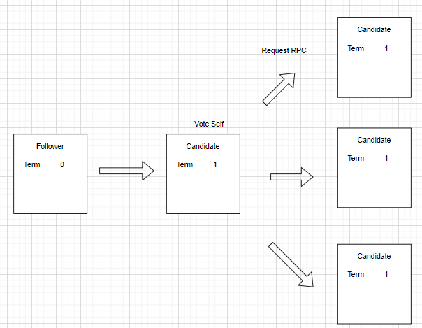

### Leader 选举

#### 选举过程
1. 服务器启动的时候, 身份为follower
2. follower会接收到来自于leader的周期心跳消息. 如果长时间没有接收到, 则需要开始新一轮的选举.

选举过程如下所示:

当选举成功的时候, leader就会像所有节点发送心跳, 用于维护leader的发言权以及防止新选举.

等待投票的过程中, candidate会收到来自于 其他节点的RPC消息(申请leader). 如果term 小于当前candidate 则拒绝这个请求. 否则, 当前candidate承认
这条消息, 并且退回到follower 状态.

#### 脑裂处理

> 发生背景
> 同一时刻, 大量follower变成candidate, 导致最终无法选举出leader

当发生这种情况的时候, candidate会超时 同时term自加并开启新一轮的选举.

但是新一轮选举仍然可能发生此类事件, raft 使用随机选举超时时间解决长时间脑裂的问题. 

具体上来说, candidate会在选举的开始重新设置随机的选举超时时间.

#### 选举限制问题
基于leader的一致性算法中, leader最终都会存储提交的日志记录信息. 
Raft 算法使用一种简单的方式 将上个term提交的日志记录信息出现在新的leader上, 不需要类似其他一致性算法 需要将数据转移到新的leader上.
但是这里需要加入一条限制, leader的日志信息只能流向follower, 且leader不能重写自己的日志.

在选举的时候, candidate若要成为leader, 则必须在提交完相关日志记录的时候才可以实现. 

如何保证选举日志最新:

通过RPC请求实现, RPC请求包含了candidate的日志信息. 当投票者发现自己的日志信息较新的时候则拒绝candidate的投票请求. 

通过比较term以及日志偏移量，判断两个日志的新旧问题. 其中term大则新,否则才去看偏移量信息

### 日志副本

1. 客户端请求过程
客户端发送一条需要副本状态机执行的命令, leader会将其作为一条新的记录插入到日志中, 然后向其他服务器发送RPC日志复制请求. 等到所有服务器成功复制,
leader就会向客户端返回执行结果.

2. 关于follower运行异常的问题
leader通过发送RPC消息, 消息中包含指令信息, 给各个follower. 只有当只有当日志成功复制且应用到状态机的时候, leader才能向客户端返回结果信息.
如果follower宕机或者运行缓慢, 或者网络数据包丢失等问题的时候, leader会重新发送RPC消息, 直到follower接受成功.

3. 日志的结构
一条日志记录, 不仅仅包含有状态机指令信息，而且需要包括当前的term信息(term主要用于发现两份日志不一致的地方). 日志内部使用偏移量index来定位记录.

4. 提交点(commited)
由leader决定什么时候将日志应用到状态机上, 这个点叫做提交点. Raft协议保证提交的entry在所有可用的状态机中可以执行. 

所以一个提交点, 必须由leader创建并且副本到大多数服务器上才能称作提交点. 这其中也包括先前leader提交的日志以及上一个leader提交的日志.

leader 需要追踪提交点的最高偏移量. follower一旦得知leader提交了之后, 就会应用到自己的状态机上.

5. leader崩溃情况下的处理
正常操作情况下, leader和follower副本保持一致. 当leader崩溃的时候, 日志就会不一致. 

当日志出现不一致的时候, leader会强制要求follower同步leader日志. 这就意味着follower副本的不同记录会被覆盖. 

这样就需要:
+ leader找到两个副本最新的,且使得两个副本内容一致的日志记录.
+ 删除这条记录后边的follower记录
+ 将leader在这条记录后边的记录通过RPC发送给follower

这些动作都是为了响应 AppendEntries RPC请求的一致性检查的

6. nextIndex的维护
对于每一个follower, leader维护一个nextIndex, 这个索引是leader发送给follower的最后一条日志记录的偏移量
+ 当leader刚刚上位的时候, 这个值为日志长度大小

+ 当一致性检查失败的时候, leader会回退这个nextIndex 并重新发送 AppendEntries RPC 请求. 这个回退操作会回退到两个日志副本同步时位置.

7. AppendEntries RPC 拒绝次数的优化

当拒绝 AppendEntries RPC 请求的时候, follower包含冲突日志的term信息,以及这个term下的首个偏移量即可
这样就是一个term一次回退, 而不是一次RPC请求一次回退.

8. 关于上一个term日志记录的提交问题

当leader在提交日志记录前宕机, 下一个leader不会将这条记录复制.

为了解决日志覆盖的问题, 对于上一个term的日志提交, raft 不使用计算副本数量的方式. 仅仅当前term的日志提交才通过计算term来实现.

9. follower和candidate 宕机问题

如果follower或者candidate宕机 那么发送到目标节点的 心跳信息 和  AppendEntries RPC 都会失败. Raft通过无限重试的方式解决这个问题.
(如果在响应完RPC之后宕机,那么恢复的时候会接收到同样的RPC消息). 由于Raft 的RPC消息具有幂等性, 所有不影响结果.

10. 可用性问题

为了保证Raft算法的安全性, 就不能依靠于时钟. 但是系统的可用性又必须依靠于时间.

Leader选举对于时钟的要求是最高的:
Raft选举的leader需要保持稳定, 就需要保持如下关系:

broadcastTimeout <= electionTimeout <= MTBF

broadcastTimeout    RPC发送时间超时时间
electionTimeout     选举超时时间
MTBF                单机失败的时间间隔

RPC需要将信息存储起来, 所以broadcastTimeout是有时间限制的, 一般情况下, 在0.5-20ms之间.
选举时间一般在10-500ms. MBTF一般在几个月的时间或者更多.

